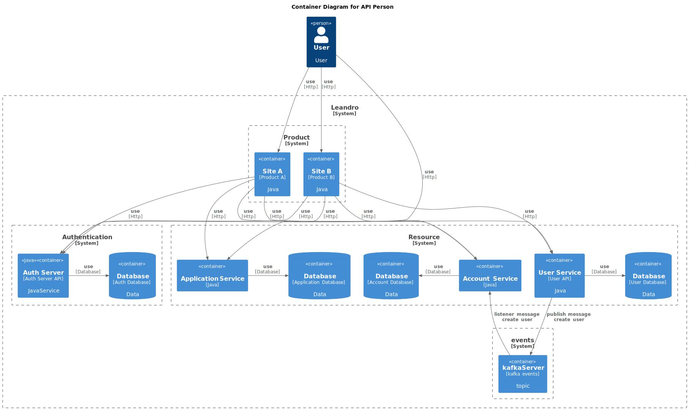

# Microservices
## Contexto do Projeto
Este projeto foi desenvolvido com o objetivo de testar conceitos de microserviços. Ele inclui um Authorization Server em Java, construído com Spring Authorization Server, e vários aplicativos React (Consumer, Creator, Account) que utilizam OpenID Connect (OIDC) para a autenticação.

As principais características deste projeto incluem:

- **Agnóstico de Tecnologia**: As APIs (Resources) foram desenvolvidas de forma a serem independentes de tecnologia, permitindo a comunicação por eventos ou HTTP, conforme necessário.
- **Comunicação entre Microserviços**: Os microserviços se comunicam entre si por meio de eventos e/ou HTTP, garantindo a interoperabilidade.
- **Arquitetura de Microserviços**: O projeto segue uma arquitetura de microserviços para facilitar a escalabilidade e a manutenção.

Este projeto busca demonstrar como os microserviços podem ser implementados de forma agnóstica de tecnologia, permitindo uma integração flexível e eficaz entre os diversos componentes do sistema.

## Tecnologias Utilizadas

As principais tecnologias e componentes deste projeto incluem:

- **Authorization Server**: Um servidor de autorização Java construído com Spring Authorization Server.
- **Aplicativos React**:
  - Consumer
  - Creator
  - Account
- **Autenticação**: Utilização do OpenID Connect (OIDC) para a parte de autenticação nos aplicativos React.
- **Conjunto de APIs (Resources)**:
  - **api-user**
  - **api-application**
  - **api-account**
  
Cada uma das APIs é independente, se comunica por meio de eventos e possui seu próprio banco de dados e contexto, sem depender das outras.

